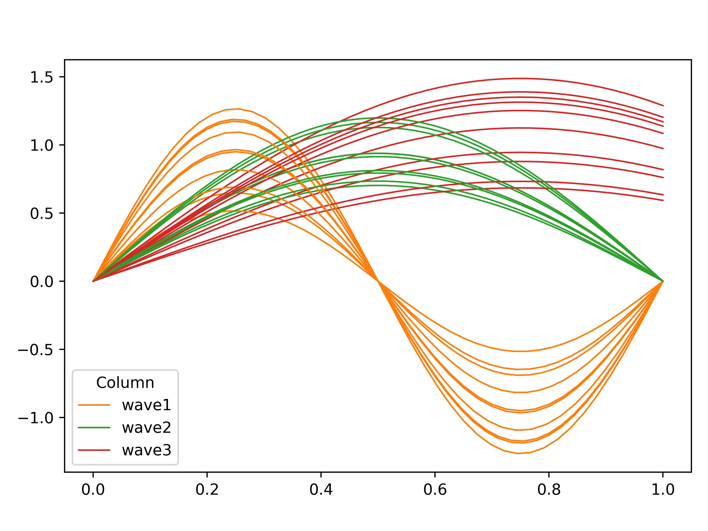

# Example

An example is provided with the `trendipy` package to demonstrate functionality.  The example commands below genereate sample data and run a pre-defined post-processor to produce and sort products as well as generating assets.

After pip installing `trendipy`, open an terminal and run the following shell commands.

``` sh
workdir=./workdir
generator=trendipy.examples:example_data_product_generator
trendipy_make_sample_data -wd $workdir -n 10  
trendipy make all -g $generator -i $workdir/models/*/ -o $workdir/trendipy_output/ -n 10 --port 8000
```

See the source code and documentation of the methods used in this example:

- [trendipy_make_sample_data][trendipy.examples.make_example_data]
- [example_data_product_generator][trendipy.examples.example_data_product_generator]

The static outputs should include the following image:


