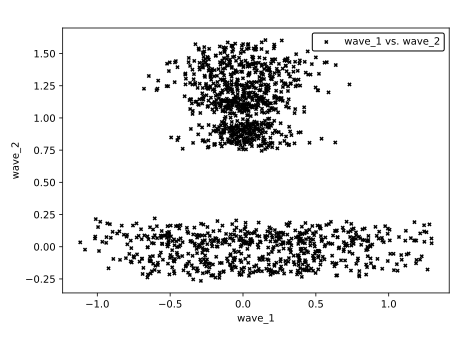
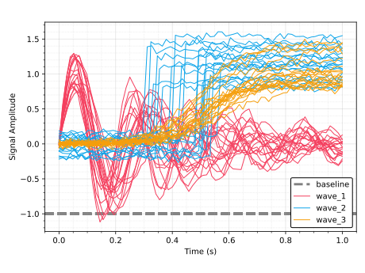
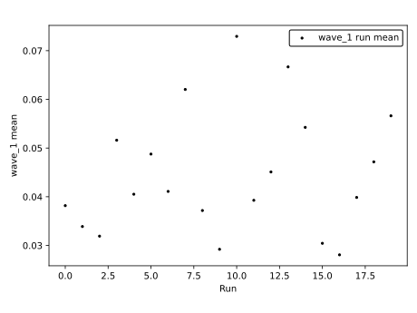
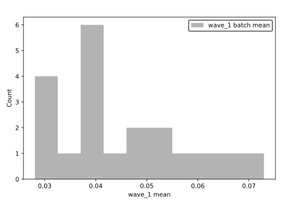

# Writing and Running a Record Generator

!!! abstract
    `trendify` turns a folder of raw run directories into plots and tables by mapping a single Python function, a **generator function**, over each one. This guide covers how to write that function and how to run it through the `trendify` CLI.

---

## Generator Function

A generator function takes a directory path as an argument and returns a `RecordList`:

???+ example "Example Generator Function Handle"
    ```python
    --8<-- "docs/example_generator.py:handle"
    ```

`trendify` calls this function once per run directory, passing that directory's `Path`. The function processes raw data, and defines and returns a list of `Record` objects (`Point2D`, `Trace2D`, `TableEntry`, `HistogramEntry`, `AxLine`, and so on), each carrying one or more **tags**.

A tag is a string, an int, or a tuple of strings and ints, for example `"histogram"` or `("an_xy_plot", "trace_plot")`. Records that share a tag get aggregated onto the same plot or table when the data is rendered.

Because of `trendify`'s unique approach to building plots, the order you define a record has no bearing on the generators execution or the plot's appearnce.

???+ example
    The example functions shown here are small record generators. In the example, it reads the `results.csv` that `trendify example-data` writes into each run directory (a `time` column plus one column per wave) and builds one example of every plottable record type.

    ```bash linenums="0"
    trendify example-data --workdir ./data --n-folders 20
    ```


### Scatter2D and Format2D

A `Scatter2D` plots a bulk collection of `(x, y)` points sharing one `Marker` style, unconnected by a line. Use it for a large array of points from one generation call that all share a style, such as a raw scatter of measurements from one run.

`Format2D` is itself a record: written once per tag, it configures that tag's axes (scale, limits, legend, grid, labels) for every other record sharing it:

???+ example
    ```python
    --8<-- "docs/example_generator.py:scatter"
    ```

<figure markdown="span">
    { width="50%" height="auto" }
    <figcaption>A rendered result of `Scatter2D` and `Format2D`.</figcaption>
</figure>

### Trace2D

A `Trace2D` draws an xy line and a `Pen` controls how it looks:

???+ example
    ```python
    --8<-- "docs/example_generator.py:traces"
    ```

### AxLine

An `AxLine` draws a horizontal or vertical reference line. Giving it the same tag as the traces above (`"time_series"`) puts it on the same plot:

???+ example
    ```python
    --8<-- "docs/example_generator.py:axline"
    ```

<figure markdown="span">
    { width="50%" height="auto" }
    <figcaption>A rendered result of `Trace2D` and `AxLine`.</figcaption>
</figure>

### Point2D

A `Point2D` is a single point, and unlike `Scatter2D` it's its own taggable, hoverable entity. This is the right choice when each point summarizes one run, aggregated across many runs that share a tag:

???+ example
    ```python
    --8<-- "docs/example_generator.py:point"
    ```

<figure markdown="span">
    { width="50%" height="auto" }
    <figcaption>A rendered result of `Point2D`.</figcaption>
</figure>

### Histogram Entry

A `HistogramEntry` bins one value into a histogram. Every entry sharing a tag (here, one per run) is binned into the same histogram:

???+ example
    ```python
    --8<-- "docs/example_generator.py:histogram"
    ```

<figure markdown="span">
    { width="50%" height="auto" }
    <figcaption>A rendered result of `HistogramEntry`.</figcaption>
</figure>

### Table Entry

A `TableEntry` is a single `(row, col, value)` cell, collected into melted, pivot, and stats tables. `row` must be distinct per run, or entries from different runs collide on the same `(row, col)` pair:

???+ example
    ```python
    --8<-- "docs/example_generator.py:table"
    ```

???+ example "`TableEntry` Result"

    === "batch_means_table_stats.csv"

        --8<-- "docs/example_data/trendify/assets/batch_means_table_stats.md"

    === "batch_means_table_pivot.csv"

        --8<-- "docs/example_data/trendify/assets/batch_means_table_pivot.md"

    === "batch_means_table_melted.csv"

        --8<-- "docs/example_data/trendify/assets/batch_means_table_melted.md"

### Putting it Together

The generator function itself just calls each of the helpers above and returns the combined list:

```python
--8<-- "docs/example_generator.py:generate_records"
```

A generator you write for real data follows the same shape: read the run directory's contents (CSV, JSON, or whatever format your raw data uses), build up a `RecordList`, tag each record according to how you want it grouped, and return the list.

---

## Running the Generator

The `trendify` CLI accepts a generator in the form `module:function`, `package.submodule.module:Class.method` (`@classmethod` or `@staticmethod`), or `/path/to/file.py:function`.

### Generating Records

`trendify generate` maps the generator over a set of input directories and writes the resulting records into a `trendify.db` under the given output directory:

```bash linenums="0"
trendify generate \
    --input-directories "./data/models/*" \
    --record-generator "docs/example_generator.py:generate_records" \
    --output-directory "./data/trendify"
```

`--input-directories` accepts glob patterns and can be repeated to combine several. Use `--n-procs` to fan the generator call out across multiple worker processes.

???+ question "But Why?"
    This can be helpful if you are still debugging your generator, or you only care about viewing interactive assets (see the later section on [Trendify Viewer](#trendify-viewer))

### Rendering Assets

`trendify render` reads the records already written to `trendify.db` and produces CSV tables and Matplotlib images, one set of assets per tag, in `<output-directory>/assets`:

```bash linenums="0"
trendify render --output-directory ./data/trendify
```

### Running In One Step

`trendify run` combines the two steps above:

```bash linenums="0"
trendify run \
    --input-directories "./data/models/*" \
    --record-generator docs/example_generator.py:generate_records \
    --output-directory ./data/trendify
```

### Trendify Viewer

`trendify viewer` launches a local web dashboard for browsing a `trendify.db` file's records interactively, by tag, table, or plot:

```bash linenums="0"
trendify viewer ./data/trendify/trendify.db
```

---

!!! success
    You can now write a `RecordGenerator` and run it end to end:

    - `generate` to write records
    - `render` for static CSV tables and plots
    - `run` to do both in one step
    - `viewer` to browse the results in a live dashboard.

    Point `--record-generator` at your own function and `--input-directories` at your real raw data to automate record creation in your project.
